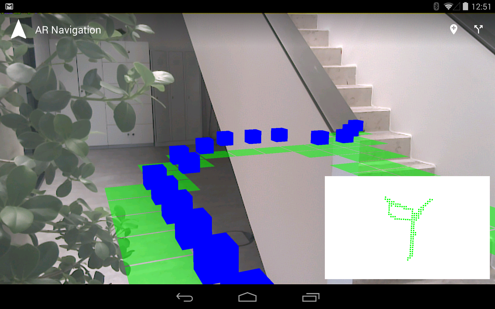

# project-tango-ar-navigation-example

This is a small example implementation of an augmented reality path 
finding navigation using Project Tango. 

* walkable floor plan is tracked inside a quadtree
* navigation through the quadtree using A* with euclidean heuristic
* the floor plan is shown in a top view and can be rotated and scaled by pinching and dragging with two fingers

 
### Development

Missing assets can be installed by `./gradlew installAssets`
